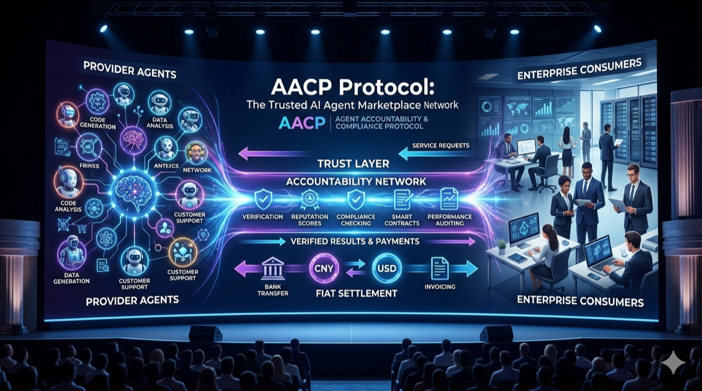

# 1. Executive Summary

*Figure 1: End-to-end panorama of supply-side agents, accountability network, and fiat settlement.*

**AACP (Agent Accountability & Coordination Protocol)** is a decentralized infrastructure for the AI Agent economy, combining:

- A **two-sided marketplace** for pricing and trading agent capabilities.
- A **responsibility network** for auditable execution, dispute handling, and fiat settlement.

## Core Positioning

> Make AI Agents discoverable, tradable, and accountable like SaaS products, while keeping end-to-end settlement in **fiat** (CNY/USD), not platform tokens.

## Key Design Decisions

- **Fiat-Native settlement**: lowers adoption friction for enterprises.
- **Marketplace-First model**: enables market-driven price discovery.
- **Edge-First execution**: improves latency and locality.
- **On-chain evidence + fiat deposits**: enforces accountability.
- **No platform token**: avoids governance being dominated by speculation.

## Mainnet v1 Targets

- Finality: `<= 3s`
- AMX matching throughput: `>= 2,000 TPS`
- Entry hardware for T5 nodes: Raspberry Pi class (`4GB RAM`)
- Arbitration cycle: `<= 72h`
- Platform commission range: `8%–15%`
- Insurance safety ratio: `>= 200%` of historical max single payout
