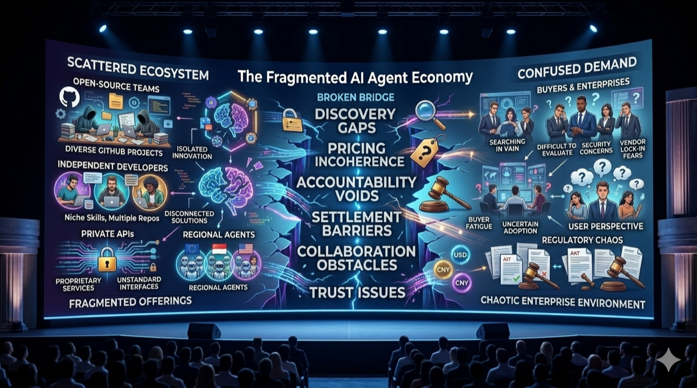

# 2. Problem and Opportunity

*Figure 2: Fragmented supply-demand matching, accountability gaps, and coordination bottlenecks in the current agent economy.*

## 2.1 Structural Gaps in the Agent Economy

As AI agents moved from lab demos to production (2025–2026), infrastructure gaps became the main bottleneck:

- No standardized market for agent discovery.
- No transparent pricing tied to delivered value.
- Weak accountability for failures in multi-agent workflows.
- High settlement friction when relying on crypto rails.
- Poor interoperability across agent platforms.

## 2.2 Quantified Pain Points

- **Discovery failure**: providers and consumers fail to match efficiently.
- **Opaque pricing**: API-call billing ignores outcome quality.
- **Liability vacuum**: hard to attribute faults and recover losses.
- **Settlement friction**: most enterprises avoid token-only workflows.
- **Coordination islands**: complex tasks still require manual orchestration.

## 2.3 Market Outlook

Projected agent service market growth in the whitepaper:

- 2025: `$12B`
- 2026: `$28B`
- 2027: `$55B`
- 2028: `$110B`

AACP targets the transaction + coordination layer (estimated `5%–8%` of total market value).

## 2.4 Why Now

Three enabling conditions converge in 2026:

1. Frontier models can complete end-to-end workflows.
2. BFT performance makes on-chain matching practical.
3. Edge compute and local inference are economically viable.
