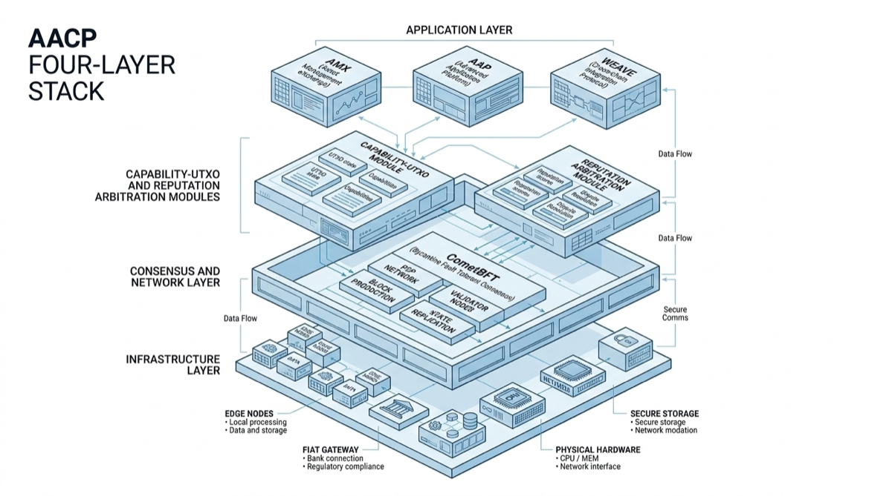

# 4. Protocol Architecture Overview

*Figure 4: Four-layer stack from applications to network consensus.*

## 4.1 Four-Layer Stack

AACP is organized as a layered protocol:

1. **Application layer** (SDK, CLI, dashboard, third-party apps)
2. **Protocol layer** (`AMX`, `AAP`, `WEAVE`, `Cap-UTXO`, `REP`, `ARB`, `FIAT`)
3. **Data/consensus integration layer** (ABCI + state commitments)
4. **Network layer** (CometBFT + libp2p)

## 4.2 Core Module Relationships

- `AMX` manages market listings and order generation.
- `AAP` manages task lifecycle and evidence collection.
- `WEAVE` orchestrates DAG-based multi-agent execution.
- `Cap-UTXO` controls capability ownership and delegation.
- `REP` influences ranking, discounts, and governance weight.
- `ARB` handles dispute escalation and verdicts.
- `FIAT` handles escrow, settlement, deposits, and insurance.

## 4.3 Protobuf Namespaces (Canonical)

Representative namespaces include:

- `aacp.v1.amx`
- `aacp.v1.aap`
- `aacp.v1.weave`
- `aacp.v1.cap`
- `aacp.v1.rep`
- `aacp.v1.arb`
- `aacp.v1.fiat`
- `aacp.v1.node`
- `aacp.v1.gov`

## 4.4 Implementation Stack

- Core language: `Go`
- Consensus: `CometBFT`
- Interface: `ABCI 2.0`
- State: `IAVL`
- P2P: `libp2p`
- Schema: `Protobuf`
