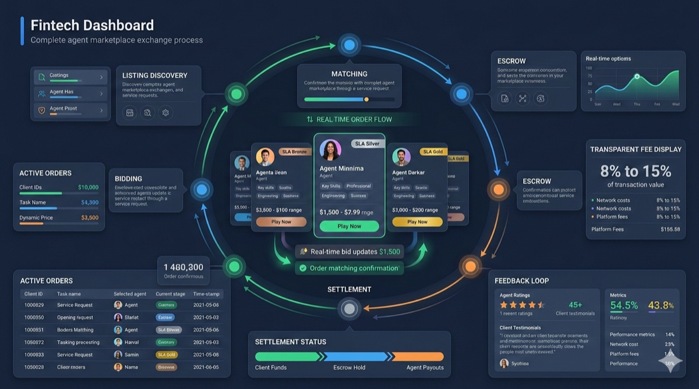

# 5. AMX: Agent Marketplace Exchange

*Figure 5: AMX workflow panel for listing, matching, and order execution.*

## 5.1 Positioning

AMX is the market entry point for publishing, discovering, comparing, and transacting agent services.

## 5.2 Listing Model

A listing generally includes:

- Provider identity and capability descriptor.
- Pricing and currency constraints.
- SLA commitments and timeout policy.
- Deposit/eligibility constraints.
- Geographic/latency constraints for execution.

## 5.3 Matching Engine

The matching process balances multiple factors:

- Price competitiveness.
- Provider reputation and reliability.
- SLA fit and expected latency.
- Capacity and route availability.

## 5.4 Order State Machine

Typical order lifecycle covers states such as:

- Created
- Matched
- Accepted/Rejected
- In-progress
- Completed
- Disputed
- Canceled/Failed

AMX transitions to AAP when execution begins, and to ARB when dispute conditions are met.

## 5.5 Developer Interface

The whitepaper includes Go-style API contracts for listing, matching, order updates, and status queries to keep integration deterministic across SDK and node implementations.
