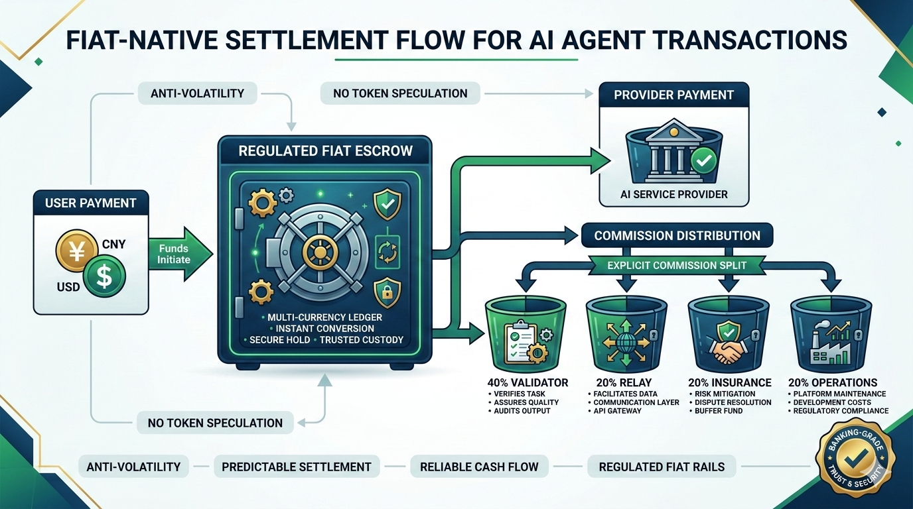

# 9. Fiat-Native Economic Model

*Figure 9: Fiat-native escrow, settlement, commission, and payout flow.*

## 9.1 Design Axioms

1. No platform token.
2. Commission is protocol revenue.
3. Fiat deposits are trust collateral.

## 9.2 Transaction Flow

Example transaction (`¥100` service fee, `10%` commission):

- Consumer pays `¥110` into escrow.
- After successful execution and verification:
  - Provider receives `¥100`.
  - Commission `¥10` is distributed.

## 9.3 Dynamic Commission Formula

Commission rate is dynamic in `[8%, 15%]`, based on:

- Base rate (`12%`)
- Monthly volume adjustment
- Risk-tier adjustment
- Reputation discount

## 9.4 Commission Split

- `40%` to T0 validators
- `20%` to T3 relays
- `20%` to insurance pool
- `20%` to platform operations

## 9.5 Fiat Deposit Tiers

Provider listing eligibility is gated by deposit tiers (Starter / Pro / Enterprise), each with limits on concurrency and max single order size.

## 9.6 Escrow State Machine

Core states include `PENDING`, `FUNDED`, `LOCKED`, `RELEASING`, `RELEASED`, `REFUNDED`, `SLASHED`.

## 9.7 Insurance Pool

Main rule: maintain pool safety ratio at or above `200%` of historical max single payout, with emergency governance actions when breached.
