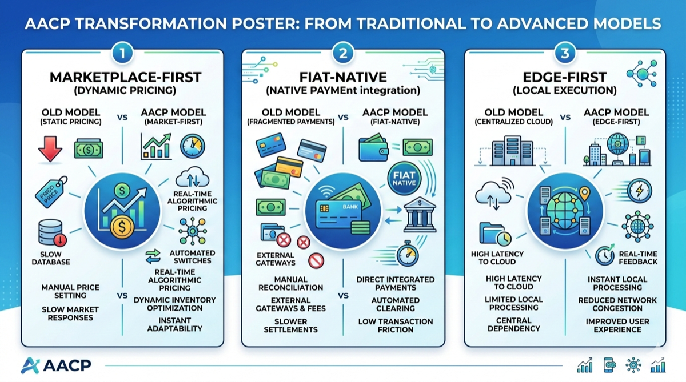

# 2. 设计哲学：三大原则



*图 3：Marketplace-First、Fiat-Native、Edge-First 三大原则的旧模型与 AACP 模型对照。*

## 2.1 Marketplace-First（市场优先）

> Agent 经济需要的不是另一个 API 网关，而是一个 **真正的双边市场**。

```
  传统模式                          AACP 模式（Marketplace-First）
  
  Provider ──→ API Gateway ──→ Consumer     Provider ──┐
  Provider ──→ API Gateway ──→ Consumer              ┌─┴──────────┐
  Provider ──→ API Gateway ──→ Consumer              │    AMX      │
                                                     │  双边市场   │──→ Consumer
  ✗ 中心化定价                                        │  价格发现   │──→ Consumer
  ✗ 无竞争机制                                        │  质量排序   │──→ Consumer
  ✗ 平台锁定                                         └─┬──────────┘
                                             Provider ──┘
                                            
                                             ✓ 供需定价
                                             ✓ 声誉竞争
                                             ✓ 零切换成本
```

**核心设计**：

- AMX（Agent Marketplace Exchange）为 Agent 服务提供标准化挂单、撮合、结算
- 价格由供需双方在链上竞价产生，不由平台方设定
- 每个 Agent 的能力（Capability）以 UTXO 形式确权，可被发现、组合、交易

## 2.2 Fiat-Native（法币原生）

> **无平台代币**。结算层直接对接法币（CNY / USD），佣金以法币计价和清算。

| 维度 | 代币模式问题 | AACP 法币原生方案 |
|------|-------------|------------------|
| 准入 | 需要购买代币，KYC + 交易所 | 银行账户 / 支付宝 / Stripe 直接支付 |
| 波动 | 代币价格波动导致服务定价不稳 | 法币定价，稳定可预期 |
| 合规 | 多数司法管辖区存在监管风险 | 法币结算天然合规 |
| 激励 | 代币激励吸引投机者而非真实用户 | 佣金分配激励真实参与者 |

**佣金机制概览**：

```
  Agent 交易总价 = 服务费 + 平台佣金（8%–15%）
  
  ┌───────────────────────────────────────┐
  │          佣金分配（每笔交易）           │
  │                                       │
  │   验证者（T0 Validator）  ████████ 40% │
  │   中继节点（T3 Relay）    ████     20% │
  │   保险池（Insurance Pool） ████     20% │
  │   平台运营（Operations）   ████     20% │
  │                                       │
  │   合计                          = 100% │
  └───────────────────────────────────────┘
```

## 2.3 Edge-First（边缘优先）

> Agent 执行应靠近数据源和用户，而非集中在云端数据中心。

```
  ┌─────────────────────────────────────────────────┐
  │                网络拓扑示意                       │
  │                                                 │
  │           ┌─────┐    ┌─────┐                    │
  │           │ T0  │────│ T0  │   共识核心          │
  │           │Valid│    │Valid│   （≤21 节点）       │
  │           └──┬──┘    └──┬──┘                    │
  │              │          │                       │
  │         ┌────┴───┐ ┌───┴────┐                   │
  │         │T1 Full │ │T1 Full │  全节点层          │
  │         └───┬────┘ └───┬────┘                   │
  │             │          │                        │
  │      ┌──┬──┴──┬──┐  ┌─┴──┬──┐                  │
  │      │T3│  T3 │T3│  │ T3 │T3│  中继层           │
  │      └┬─┘  └┬─┘└┬┘  └─┬──┘└┬┘                  │
  │       │     │   │     │    │                    │
  │    ┌──┴┐ ┌─┴┐ ┌┴──┐ ┌┴─┐ ┌┴──┐                │
  │    │T4 │ │T4│ │T4 │ │T4│ │T4 │ 边缘执行层      │
  │    │Edg│ │  │ │Edg│ │  │ │Edg│                  │
  │    └┬──┘ └──┘ └┬──┘ └──┘ └┬──┘                  │
  │     │          │          │                     │
  │   ┌─┴──┐   ┌──┴─┐    ┌──┴─┐                    │
  │   │ T5 │   │ T5 │    │ T5 │  微节点             │
  │   │Micr│   │Micr│    │Micr│  （IoT/手机）       │
  │   └────┘   └────┘    └────┘                     │
  └─────────────────────────────────────────────────┘
```

**边缘优先的量化收益**：

| 场景 | 云中心化延迟 | Edge-First 延迟 | 改善 |
|------|------------|----------------|------|
| 本地文件处理 Agent | 200–500ms（上传+处理+下载） | 10–50ms（本地执行） | 4–50x |
| IoT 数据分析 Agent | 300–800ms | 5–20ms | 15–160x |
| 实时对话 Agent | 150–300ms | 30–80ms | 2–10x |
| 多 Agent 协作链 | N × 200ms | N × 20ms | ~10x |

---
