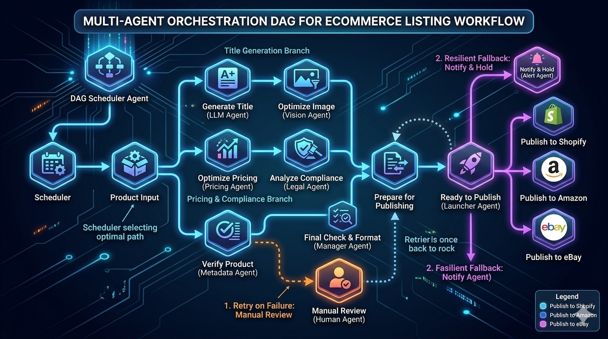

# 7. WEAVE：多 Agent 协调引擎



*图 7：WEAVE 多分支 DAG 编排、发布前检查、失败回退与多平台发布路径。*

## 7.1 WEAVE 定位

WEAVE（Workflow Engine for Agent Versatile Execution）解决 **复杂任务需要多个 Agent 协作** 的场景。它将一个顶层任务拆分为 DAG（有向无环图），每个节点对应一个子任务，由不同 Agent 独立执行。

```
  WEAVE 核心概念

  ┌─────────────────────────────────────────────────────────┐
  │                     WEAVE DAG                           │
  │                                                         │
  │              ┌──────────┐                               │
  │              │ 顶层任务  │                               │
  │              │ (Root)   │                               │
  │              └────┬─────┘                               │
  │           ┌───────┼───────┐                             │
  │           ▼       ▼       ▼                             │
  │      ┌────────┐┌────────┐┌────────┐                    │
  │      │ Sub-A  ││ Sub-B  ││ Sub-C  │   可并行            │
  │      │Agent-1 ││Agent-2 ││Agent-3 │                    │
  │      └───┬────┘└───┬────┘└───┬────┘                    │
  │          │         │         │                         │
  │          └─────────┼─────────┘                         │
  │                    ▼                                    │
  │              ┌────────┐                                 │
  │              │ Sub-D  │   依赖 A+B+C 的输出             │
  │              │Agent-4 │                                 │
  │              └───┬────┘                                 │
  │                  ▼                                      │
  │              ┌────────┐                                 │
  │              │ Merge  │   聚合最终结果                    │
  │              │ (Root) │                                 │
  │              └────────┘                                 │
  └─────────────────────────────────────────────────────────┘
```

## 7.2 DAG 定义

```protobuf
// aacp.v1.weave — DAG 定义
message TaskDAG {
  string dag_id     = 1;   // 全局唯一
  string root_task  = 2;   // 关联的 AAP task_id
  bytes  orchestrator = 3; // 编排者公钥

  repeated DAGNode  nodes = 4;
  repeated DAGEdge  edges = 5;

  DAGStatus status    = 6;
  int64     created_at = 7;
}

message DAGNode {
  string node_id       = 1;
  string label         = 2;   // 人类可读描述
  NodeType type        = 3;

  // 子任务绑定
  string sub_task_id   = 4;   // 关联的 AAP task_id（执行时填充）
  string listing_id    = 5;   // 指定 Agent 或留空让 WEAVE 自动撮合

  // 能力要求
  repeated string required_caps = 6;

  // 输入/输出 schema（JSON Schema）
  string input_schema  = 7;
  string output_schema = 8;

  NodeStatus status    = 9;
}

message DAGEdge {
  string from_node = 1;
  string to_node   = 2;
  string condition  = 3;  // 可选: CEL 表达式, 如 "output.score > 0.8"
}

enum NodeType {
  NODE_TASK     = 0;  // 普通任务节点
  NODE_FORK     = 1;  // 分叉（并行）
  NODE_JOIN     = 2;  // 汇合（等待所有前驱）
  NODE_COND     = 3;  // 条件分支
  NODE_LOOP     = 4;  // 循环（带终止条件）
}

enum NodeStatus {
  NODE_PENDING    = 0;
  NODE_READY      = 1;  // 所有前驱完成
  NODE_RUNNING    = 2;
  NODE_COMPLETED  = 3;
  NODE_FAILED     = 4;
  NODE_SKIPPED    = 5;  // 条件分支跳过
}

enum DAGStatus {
  DAG_PENDING    = 0;
  DAG_RUNNING    = 1;
  DAG_COMPLETED  = 2;
  DAG_FAILED     = 3;
  DAG_CANCELED   = 4;
}
```

## 7.3 调度算法

WEAVE 调度器执行 **拓扑排序 + 就绪队列** 策略：

```
  WEAVE 调度循环

  ┌─────────────────────────────────────────────────────┐
  │                                                     │
  │  while DAG.status == RUNNING:                       │
  │    │                                                │
  │    ├─ 1. 扫描所有 PENDING 节点                       │
  │    │     if 所有前驱 edge 的 from_node.status ==     │
  │    │        COMPLETED (且 condition 满足):           │
  │    │       → 标记为 READY                            │
  │    │                                                │
  │    ├─ 2. 对每个 READY 节点:                          │
  │    │     if node.listing_id 非空:                    │
  │    │       → 直接创建 AAP 子任务                      │
  │    │     else:                                      │
  │    │       → 调用 AMX 撮合, 选择最优 Agent           │
  │    │     标记为 RUNNING                              │
  │    │                                                │
  │    ├─ 3. 监听子任务完成事件:                          │
  │    │     on SubTaskCompleted(node_id):               │
  │    │       → 标记为 COMPLETED                        │
  │    │       → 将 output 传播给下游节点的 input         │
  │    │     on SubTaskFailed(node_id):                  │
  │    │       → 根据重试策略决定 RETRY 或 FAILED         │
  │    │       → 若 FAILED, 检查是否有备选路径            │
  │    │                                                │
  │    └─ 4. 终止检测:                                   │
  │         if 所有叶子节点 COMPLETED → DAG COMPLETED     │
  │         if 任何关键路径节点 FAILED → DAG FAILED       │
  │                                                     │
  └─────────────────────────────────────────────────────┘
```

## 7.4 数据传递

节点之间通过 **DataRef** 传递中间结果，小数据直接上链，大数据存 IPFS：

```go
// pkg/weave/dataref.go

package weave

const InlineDataMaxBytes = 4096

type DataRef struct {
    // 二选一
    Inline []byte `json:"inline,omitempty"` // ≤ 4KB 直接内联
    IPFSCID string `json:"ipfs_cid,omitempty"` // > 4KB 存 IPFS

    ContentHash [32]byte `json:"content_hash"` // SHA-256, 始终填充
    SizeBytes   uint64   `json:"size_bytes"`
    MimeType    string   `json:"mime_type"`
    Encrypted   bool     `json:"encrypted"`      // 是否 AES-GCM 加密
}

func NewDataRef(data []byte, mimeType string) *DataRef {
    ref := &DataRef{
        ContentHash: sha256Sum(data),
        SizeBytes:   uint64(len(data)),
        MimeType:    mimeType,
    }
    if len(data) <= InlineDataMaxBytes {
        ref.Inline = data
    }
    return ref
}
```

## 7.5 实际案例：电商商品上架 Agent 协作

```
  场景：商家上传一张商品图，WEAVE 编排 4 个 Agent 完成上架

  ┌─────────────────────────────────────────────────────┐
  │                                                     │
  │  [Input: 商品图片]                                   │
  │         │                                           │
  │         ▼                                           │
  │  ┌──────────────┐                                   │
  │  │ A: 图像识别   │  Agent-Vision                     │
  │  │ 提取商品属性  │  Cap: image_recognition            │
  │  └──────┬───────┘                                   │
  │         │ {category, color, material, ...}           │
  │    ┌────┴────┐                                      │
  │    ▼         ▼                                      │
  │ ┌────────┐ ┌────────────┐                           │
  │ │B: 文案  │ │C: 定价建议  │  可并行执行               │
  │ │ 生成   │ │ (竞品分析)  │                           │
  │ │Agent-  │ │ Agent-     │                           │
  │ │Copywr. │ │ Pricing    │                           │
  │ └───┬────┘ └─────┬──────┘                           │
  │     │            │                                  │
  │     └─────┬──────┘                                  │
  │           ▼                                         │
  │    ┌──────────────┐                                 │
  │    │D: 商品详情页  │  Agent-PageBuilder               │
  │    │  自动排版     │  Cap: html_generation            │
  │    └──────┬───────┘                                 │
  │           ▼                                         │
  │    [Output: 完整商品详情页 HTML + 建议售价]            │
  │                                                     │
  │  总耗时: max(B,C) + A + D ≈ 2s + 3s + 1s = 6s      │
  │  串行耗时: A + B + C + D ≈ 2s + 3s + 3s + 1s = 9s  │
  │  并行加速比: 1.5x                                   │
  └─────────────────────────────────────────────────────┘
```

对应 DAG 定义：

```python
# 伪代码 — 构建商品上架 DAG
from aacp_sdk import WeaveClient, DAGBuilder

dag = DAGBuilder(root_task="product_listing_001")

node_a = dag.add_task("vision", required_caps=["image_recognition"])
node_b = dag.add_task("copywriting", required_caps=["text_generation"])
node_c = dag.add_task("pricing", required_caps=["market_analysis"])
node_d = dag.add_task("page_builder", required_caps=["html_generation"])

dag.add_edge(node_a, node_b)   # B 依赖 A 的属性输出
dag.add_edge(node_a, node_c)   # C 依赖 A 的品类信息
dag.add_edge(node_b, node_d)   # D 依赖 B 的文案
dag.add_edge(node_c, node_d)   # D 依赖 C 的定价

weave = WeaveClient("https://relay.aacp.network:8443")
result = weave.execute(dag, timeout_sec=30)
print(f"页面: {result.output['html_url']}, 建议价: {result.output['price']}")
```

## 7.6 WEAVE 容错策略

| 故障类型 | 检测方式 | 恢复策略 |
|---------|---------|---------|
| 子任务超时 | AAP 心跳丢失 | 重新撮合备选 Agent，最多重试 3 次 |
| 子任务失败 | AAP 状态 → FAILED | 检查 DAG 中是否有备选路径（冗余边） |
| Agent 崩溃 | 连续 3 次心跳缺失 | 标记 Agent 不可用，信誉扣分，重新调度 |
| 数据传递失败 | IPFS CID 不可达 | Relay 节点缓存层重试，超时则 FAILED |
| DAG 死锁 | 循环依赖检测 | 构建时拓扑排序预检，运行时 watchdog 超时 |
| 编排者离线 | 编排者心跳丢失 | T0 Validator 接管编排权，继续执行 |

---
