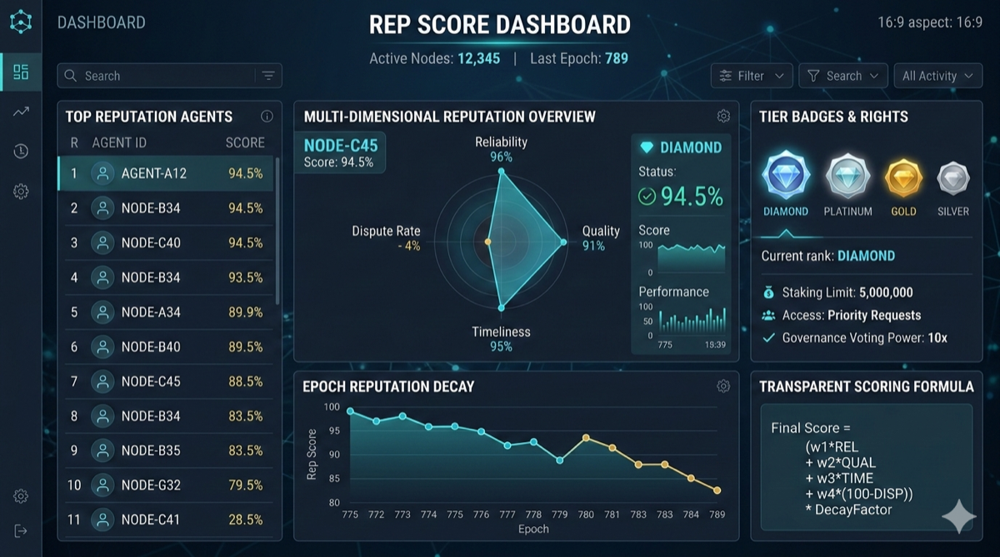

# 10. 信誉系统



*图 11：多维信誉评分面板，展示可靠性、时效性、质量与争议率等核心指标。*

## 10.1 设计目标

信誉系统（REP）为 AACP 网络中的每个参与者——Provider、Consumer、Validator、Relay——维护一个 **链上多维信誉评分**，直接影响撮合排序、佣金折扣、保证金要求和仲裁权重。

```
┌──────────────────────────────────────────────────────────────┐
│                 信誉系统核心循环                                │
│                                                              │
│    行为 ──→ 评分更新 ──→ 影响权益 ──→ 激励行为 ──→ ...        │
│                                                              │
│  ┌──────────┐   ┌──────────┐   ┌──────────────┐             │
│  │ 正向行为  │   │ 评分上升  │   │ 佣金下降     │             │
│  │ 按时交付  │──→│ REP += Δ │──→│ 排序靠前     │──→ 更多订单  │
│  │ 高质量   │   │          │   │ 保证金减免   │             │
│  └──────────┘   └──────────┘   └──────────────┘             │
│                                                              │
│  ┌──────────┐   ┌──────────┐   ┌──────────────┐             │
│  │ 负向行为  │   │ 评分下降  │   │ 佣金上升     │             │
│  │ 超时失败  │──→│ REP -= Δ │──→│ 排序靠后     │──→ 订单减少  │
│  │ 欺诈     │   │          │   │ 挂单暂停     │             │
│  └──────────┘   └──────────┘   └──────────────┘             │
└──────────────────────────────────────────────────────────────┘
```

## 10.2 多维评分模型

每个参与者维护 **5 个维度** 的子评分，加权合成总分：

```
  总信誉分 R = Σ(wᵢ × Dᵢ),  R ∈ [0, 1000]

  ┌──────────────┬────────┬────────────────────────────────────┐
  │ 维度 Dᵢ      │ 权重 wᵢ │ 计算依据                            │
  ├──────────────┼────────┼────────────────────────────────────┤
  │ 交付质量     │  0.30  │ 任务成功率、验证通过率、Consumer评价  │
  │ (Quality)    │        │                                    │
  ├──────────────┼────────┼────────────────────────────────────┤
  │ 时效性       │  0.25  │ 平均完成时间 / SLA约定时间           │
  │ (Timeliness) │        │                                    │
  ├──────────────┼────────┼────────────────────────────────────┤
  │ 可靠性       │  0.20  │ 心跳在线率、任务中断率、重试率       │
  │ (Reliability)│        │                                    │
  ├──────────────┼────────┼────────────────────────────────────┤
  │ 争议记录     │  0.15  │ 争议发起率、败诉率、赔付历史         │
  │ (Disputes)   │        │                                    │
  ├──────────────┼────────┼────────────────────────────────────┤
  │ 网络贡献     │  0.10  │ 节点在线时长、中继转发量、验证参与    │
  │ (Network)    │        │                                    │
  └──────────────┴────────┴────────────────────────────────────┘
```

```protobuf
// aacp.v1.rep — 信誉评分
message ReputationScore {
  bytes   entity         = 1;  // Ed25519 公钥
  string  entity_type    = 2;  // "provider" | "consumer" | "validator" | "relay"

  // 子维度分 (0–1000)
  uint32  quality_score     = 3;
  uint32  timeliness_score  = 4;
  uint32  reliability_score = 5;
  uint32  dispute_score     = 6;
  uint32  network_score     = 7;

  // 加权总分 (0–1000)
  uint32  total_score    = 8;

  // 统计数据
  uint64  total_tasks    = 9;
  uint64  success_tasks  = 10;
  uint64  failed_tasks   = 11;
  uint64  disputed_tasks = 12;

  int64   last_updated   = 13;
  uint64  update_epoch   = 14;  // 最近一次评分更新的 Epoch
}
```

## 10.3 评分更新规则

每次任务完成（成功或失败）时，链上自动更新信誉分：

```
  任务完成 → 评分增量计算

  ┌─────────────────────────────────────────────────┐
  │  输入:                                           │
  │    task_result   ∈ {SUCCESS, FAILED, DISPUTED}   │
  │    completion_ms  (实际耗时)                      │
  │    sla_timeout_ms (SLA约定耗时)                   │
  │    consumer_rating ∈ [1, 5]                      │
  │    verification_passed: bool                      │
  │                                                  │
  │  Quality 增量:                                    │
  │    if SUCCESS && verification_passed:             │
  │      Δq = +10 × (consumer_rating / 5.0)          │
  │    elif FAILED:                                   │
  │      Δq = -30                                    │
  │    elif DISPUTED && provider_lost:                │
  │      Δq = -50                                    │
  │                                                  │
  │  Timeliness 增量:                                 │
  │    ratio = completion_ms / sla_timeout_ms         │
  │    if ratio ≤ 0.5:  Δt = +8   (远快于SLA)        │
  │    elif ratio ≤ 1.0: Δt = +4  (在SLA内)          │
  │    elif ratio ≤ 1.5: Δt = -10 (轻微超时)          │
  │    else:             Δt = -25 (严重超时)           │
  │                                                  │
  │  最终: Dᵢ = clamp(Dᵢ + Δᵢ, 0, 1000)             │
  │        total = Σ(wᵢ × Dᵢ)                        │
  └─────────────────────────────────────────────────┘
```

## 10.4 信誉衰减

长期不活跃的参与者信誉自然衰减，避免"僵尸高分"：

```go
// pkg/rep/decay.go

package rep

const (
    DecayEpochs    = 4    // 连续 4 个 Epoch 无活动触发衰减
    DecayRate      = 0.02 // 每 Epoch 衰减 2%
    MinDecayScore  = 100  // 衰减下限
    EpochDuration  = 7    // 1 Epoch = 7 天
)

func ApplyDecay(score *ReputationScore, currentEpoch uint64) {
    inactive := currentEpoch - score.UpdateEpoch
    if inactive < DecayEpochs {
        return
    }

    decayEpochs := inactive - DecayEpochs + 1
    multiplier := 1.0
    for i := uint64(0); i < decayEpochs; i++ {
        multiplier *= (1.0 - DecayRate)
    }

    dimensions := []*uint32{
        &score.QualityScore,
        &score.TimelinessScore,
        &score.ReliabilityScore,
        &score.DisputeScore,
        &score.NetworkScore,
    }

    for _, d := range dimensions {
        newVal := uint32(float64(*d) * multiplier)
        if newVal < MinDecayScore {
            newVal = MinDecayScore
        }
        *d = newVal
    }

    score.TotalScore = computeTotal(score)
}
```

## 10.5 信誉等级与权益映射

| 信誉总分 | 等级 | 标识 | 权益 |
|---------|------|------|------|
| 900–1000 | 钻石 | Diamond | 佣金率降至 8%，撮合排序 +30% 加权，可参选 T0 |
| 700–899 | 铂金 | Platinum | 佣金率 -2%，撮合排序 +15% 加权 |
| 500–699 | 黄金 | Gold | 标准佣金率，标准排序 |
| 300–499 | 白银 | Silver | 佣金率 +1%，需额外保证金 20% |
| 100–299 | 青铜 | Bronze | 佣金率 +3%，限制并发任务数 50% |
| 0–99 | 受限 | Restricted | 暂停挂单，仅可接受仲裁和申诉 |

```
  信誉等级 ↔ AMX 撮合权重关系

  撮合 RepScore = raw_score × tier_multiplier

  Diamond:   ×1.30  ████████████████████████████████░░  1.30
  Platinum:  ×1.15  █████████████████████████████░░░░░  1.15
  Gold:      ×1.00  ██████████████████████████░░░░░░░░  1.00
  Silver:    ×0.85  ██████████████████████░░░░░░░░░░░░  0.85
  Bronze:    ×0.60  ███████████████░░░░░░░░░░░░░░░░░░░  0.60
  Restricted: ×0   (不参与撮合)
```

---
