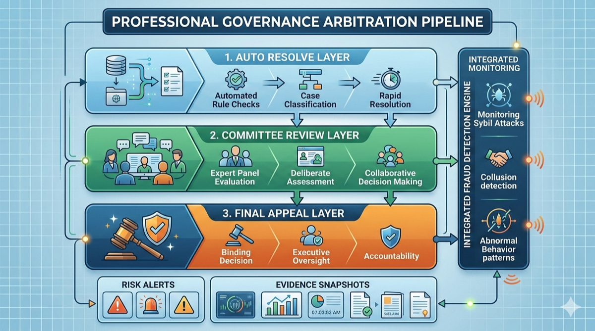

# 11. 争议仲裁与反欺诈



*图 12：自动裁决、委员会复核与终审层协同，外接欺诈检测引擎与证据快照。*

## 11.1 三阶段仲裁体系

AACP 的争议解决采用 **渐进升级** 策略，绝大多数争议在前两个阶段自动化解决：

```
  ┌──────────────────────────────────────────────────────────────┐
  │                   三阶段仲裁流程                               │
  │                                                              │
  │  阶段 1: 自动仲裁 (80% 争议在此解决)                           │
  │  ┌───────────────────────────────────────────┐               │
  │  │  规则引擎 + 证据链自动比对                    │               │
  │  │  SLA 合规检查 → 心跳记录 → 结果验证           │               │
  │  │  裁决时间: ≤ 10 分钟                         │               │
  │  └─────────────────────┬─────────────────────┘               │
  │                        │ 无法自动判定                          │
  │                        ▼                                     │
  │  阶段 2: 委员会仲裁 (15% 争议在此解决)                         │
  │  ┌───────────────────────────────────────────┐               │
  │  │  随机选取 5 名高信誉 Validator 组成仲裁委员会  │               │
  │  │  双方提交补充证据 → 投票表决 (3/5 多数)       │               │
  │  │  裁决时间: ≤ 24 小时                         │               │
  │  └─────────────────────┬─────────────────────┘               │
  │                        │ 任一方不服                            │
  │                        ▼                                     │
  │  阶段 3: 全网仲裁 (≤5% 争议到达此阶段)                         │
  │  ┌───────────────────────────────────────────┐               │
  │  │  全部 T0 Validator 参与投票 (2/3 超多数)     │               │
  │  │  证据公开、投票记录上链                       │               │
  │  │  裁决时间: ≤ 72 小时                         │               │
  │  │  裁决结果为最终裁决，不可再上诉               │               │
  │  └───────────────────────────────────────────┘               │
  │                                                              │
  └──────────────────────────────────────────────────────────────┘
```

## 11.2 仲裁状态机

```
                      争议仲裁状态机

  ┌────────────┐
  │  FILED     │  任一方提交争议
  └─────┬──────┘
        │ auto_evaluate
        ▼
  ┌────────────┐   auto_resolved   ┌──────────────┐
  │ AUTO_REVIEW│─────────────────→│ AUTO_RESOLVED │
  └─────┬──────┘                  └──────────────┘
        │ escalate
        ▼
  ┌────────────┐   committee_vote  ┌──────────────┐
  │ COMMITTEE  │─────────────────→│ COMM_RESOLVED │
  │ _REVIEW    │                  └──────────────┘
  └─────┬──────┘
        │ appeal
        ▼
  ┌────────────┐   full_vote       ┌──────────────┐
  │ FULL_REVIEW│─────────────────→│FINAL_RESOLVED │
  └────────────┘                  └──────────────┘

  每个 RESOLVED 状态均携带:
    verdict:   "consumer_wins" | "provider_wins" | "split"
    actions:   [refund?, slash?, rep_penalty?, ban?]
```

```protobuf
// aacp.v1.arb — 争议仲裁
message Dispute {
  string  dispute_id     = 1;
  string  order_id       = 2;   // 关联 AMX 订单
  string  task_id        = 3;   // 关联 AAP 任务
  bytes   plaintiff      = 4;   // 原告 Ed25519 公钥
  bytes   defendant      = 5;   // 被告
  string  reason         = 6;   // 争议原因描述
  
  // 证据
  repeated EvidenceItem evidence = 7;
  
  // 仲裁过程
  ArbitrationPhase phase   = 8;
  DisputeStatus    status  = 9;
  
  // 裁决
  Verdict verdict          = 10;
  
  int64   filed_at         = 11;
  int64   resolved_at      = 12;
}

message EvidenceItem {
  bytes   submitter   = 1;
  string  type        = 2;   // "sla" | "action_log" | "screenshot" | "api_trace"
  string  ipfs_cid    = 3;   // 大文件存 IPFS
  bytes   inline_data = 4;   // 小数据内联
  bytes   content_hash = 5;  // SHA-256
  int64   submitted_at = 6;
}

message Verdict {
  string   winner        = 1;  // "consumer" | "provider" | "split"
  string   refund_amount = 2;  // 退款金额
  string   slash_amount  = 3;  // 罚没金额 (从Provider保证金扣)
  int32    rep_penalty   = 4;  // 信誉扣分
  bool     ban           = 5;  // 是否封禁
  string   reasoning     = 6;  // 裁决理由 (链上存储)
  
  // 投票记录 (阶段2/3)
  repeated VoteRecord votes = 7;
}

message VoteRecord {
  bytes   validator   = 1;
  string  vote        = 2;  // "consumer" | "provider" | "split" | "abstain"
  int64   voted_at    = 3;
  bytes   signature   = 4;
}

enum ArbitrationPhase {
  PHASE_AUTO      = 0;
  PHASE_COMMITTEE = 1;
  PHASE_FULL      = 2;
}
```

## 11.3 自动仲裁规则引擎

阶段 1 自动仲裁基于预定义规则链：

```
  自动仲裁规则链 (按优先级顺序)

  ┌─────────────────────────────────────────────────────────┐
  │  Rule 1: SLA 超时检查                                    │
  │  if task.completion_time > sla.timeout_sec × 1.0:       │
  │    → verdict = consumer_wins                            │
  │    → refund = 100% service_fee                          │
  │    → slash = 10% deposit                                │
  │    → rep_penalty = -30                                  │
  │                                                         │
  │  Rule 2: 心跳丢失检查                                    │
  │  if missed_heartbeats >= 6 (连续 3 分钟):                │
  │    → verdict = consumer_wins                            │
  │    → refund = 100%                                      │
  │    → slash = 5% deposit                                 │
  │    → rep_penalty = -20                                  │
  │                                                         │
  │  Rule 3: 结果验证失败                                    │
  │  if verification.passed == false && retries >= 3:       │
  │    → verdict = consumer_wins                            │
  │    → refund = 80%                                       │
  │    → rep_penalty = -40                                  │
  │                                                         │
  │  Rule 4: Consumer 无正当理由拒绝                          │
  │  if task.status == VERIFIED && consumer refuses payment: │
  │    → verdict = provider_wins                            │
  │    → release = 100% service_fee to provider             │
  │    → consumer rep_penalty = -20                         │
  │                                                         │
  │  Rule 5: 证据不足                                        │
  │  if 以上规则均不匹配:                                     │
  │    → escalate to PHASE_COMMITTEE                        │
  └─────────────────────────────────────────────────────────┘
```

## 11.4 反欺诈引擎（AFD）

```
  ┌──────────────────────────────────────────────────────────┐
  │                  反欺诈检测层级                             │
  │                                                          │
  │   Layer 1: 实时规则检测 (链上, 每笔 Tx)                    │
  │   ┌───────────────────────────────────────────┐          │
  │   │  • Sybil 检测: 同 IP/设备 注册多 Provider   │          │
  │   │  • 自交易检测: Provider == Consumer (关联分析)│         │
  │   │  • 价格操纵: 异常低价/高价 > 3σ 偏离         │          │
  │   │  • 刷单检测: 高频微额交易模式                 │          │
  │   └───────────────────────────────────────────┘          │
  │                        │                                 │
  │   Layer 2: 批量统计分析 (链下, 每 Epoch)                   │
  │   ┌───────────────────────────────────────────┐          │
  │   │  • 交易图谱分析: 识别环路交易、资金回流       │          │
  │   │  • 行为聚类: 异常行为模式识别                 │          │
  │   │  • 信誉注水: 互评/自评模式检测                │          │
  │   │  • 地理异常: 声称区域与实际 IP 不符           │          │
  │   └───────────────────────────────────────────┘          │
  │                        │                                 │
  │   Layer 3: 深度调查 (人工 + AI, 按需触发)                  │
  │   ┌───────────────────────────────────────────┐          │
  │   │  • 仲裁委员会介入的复杂欺诈案件              │          │
  │   │  • 跨区域、跨时段的组织化欺诈                 │          │
  │   │  • 新型攻击向量的模式归纳与规则更新           │          │
  │   └───────────────────────────────────────────┘          │
  └──────────────────────────────────────────────────────────┘
```

## 11.5 Sybil 防御

```go
// pkg/afd/sybil.go

package afd

import (
    "crypto/sha256"
    "encoding/hex"
    "time"
)

type SybilDetector struct {
    ipIndex      map[string][]string  // IP → []pubkey_hex
    hwIndex      map[string][]string  // HW fingerprint → []pubkey_hex
    regWindow    time.Duration        // 检测时间窗口
    maxPerIP     int                  // 同 IP 最大注册数
    maxPerHW     int                  // 同硬件指纹最大注册数
}

type SybilAlert struct {
    AlertType string    // "same_ip" | "same_hw" | "rapid_reg"
    Pubkeys   []string  // 关联公钥
    Score     float64   // 0.0–1.0, 越高越可疑
    Timestamp time.Time
}

func NewSybilDetector() *SybilDetector {
    return &SybilDetector{
        ipIndex:   make(map[string][]string),
        hwIndex:   make(map[string][]string),
        regWindow: 24 * time.Hour,
        maxPerIP:  3,
        maxPerHW:  2,
    }
}

func (sd *SybilDetector) CheckRegistration(pubkey [32]byte, ip string, hwFingerprint string) []SybilAlert {
    var alerts []SybilAlert
    pkHex := hex.EncodeToString(pubkey[:])

    if keys, ok := sd.ipIndex[ip]; ok && len(keys) >= sd.maxPerIP {
        alerts = append(alerts, SybilAlert{
            AlertType: "same_ip",
            Pubkeys:   append(keys, pkHex),
            Score:     float64(len(keys)+1) / float64(sd.maxPerIP*2),
        })
    }

    hwHash := sha256Hex(hwFingerprint)
    if keys, ok := sd.hwIndex[hwHash]; ok && len(keys) >= sd.maxPerHW {
        alerts = append(alerts, SybilAlert{
            AlertType: "same_hw",
            Pubkeys:   append(keys, pkHex),
            Score:     float64(len(keys)+1) / float64(sd.maxPerHW*2),
        })
    }

    if len(alerts) == 0 {
        sd.ipIndex[ip] = append(sd.ipIndex[ip], pkHex)
        sd.hwIndex[hwHash] = append(sd.hwIndex[hwHash], pkHex)
    }

    return alerts
}

func sha256Hex(s string) string {
    h := sha256.Sum256([]byte(s))
    return hex.EncodeToString(h[:])
}
```

## 11.6 处罚梯度

| 违规等级 | 行为示例 | 信誉扣分 | 保证金罚没 | 其他后果 |
|---------|---------|---------|----------|---------|
| 轻微 | 单次超时、单次心跳丢失 | -10~-20 | 0% | 无 |
| 一般 | 多次交付失败、低质量结果 | -20~-50 | 5%–10% | 降低并发限制 |
| 严重 | 仲裁败诉、恶意拒绝交付 | -50~-100 | 10%–30% | 暂停挂单 7 天 |
| 极严重 | Sybil 攻击、刷单欺诈 | -200~-500 | 50%–100% | 永久封禁 |
| 系统性 | 组织化欺诈、勾结攻击 | 归零 | 100% | 永久封禁 + 公示 |

---
