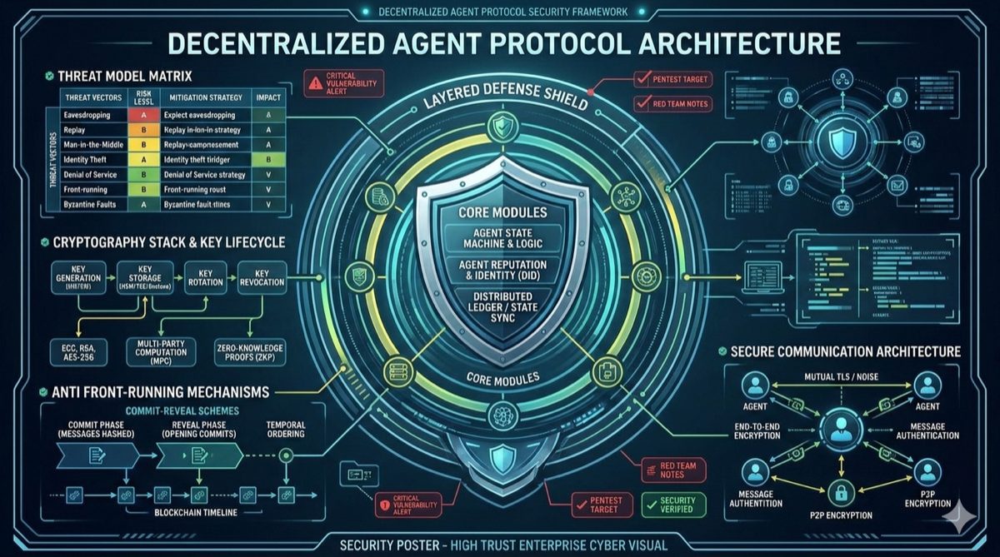

# 12. 安全架构



*图 13：分层防御、威胁矩阵、密码学密钥生命周期与安全通信体系总览。*

## 12.1 威胁模型

```
┌──────────────────────────────────────────────────────────────────┐
│                        AACP 威胁模型                              │
│                                                                  │
│  攻击面           │  威胁                  │  缓解措施             │
│  ────────────────┼───────────────────────┼──────────────────── │
│  共识层           │  拜占庭节点 (<1/3)     │  CometBFT BFT 容错   │
│                  │  长程攻击              │  弱主观性检查点        │
│  ────────────────┼───────────────────────┼──────────────────── │
│  P2P 网络        │  Eclipse 攻击          │  多路径连接、种子轮换  │
│                  │  DDoS                  │  Rate limiting + PoW │
│  ────────────────┼───────────────────────┼──────────────────── │
│  AMX 市场        │  价格操纵              │  3σ 异常检测          │
│                  │  抢跑 (Front-running)  │  提交-揭示方案        │
│  ────────────────┼───────────────────────┼──────────────────── │
│  AAP 任务        │  结果伪造              │  证据链 + 验证节点    │
│                  │  Provider 跑路         │  法币保证金 + Escrow  │
│  ────────────────┼───────────────────────┼──────────────────── │
│  Cap-UTXO        │  权限提升              │  链上派生规则强制执行  │
│                  │  重放攻击              │  Nonce + UTXO 单花   │
│  ────────────────┼───────────────────────┼──────────────────── │
│  法币网关        │  双花 / 退款欺诈       │  支付确认等待 + 风控  │
│                  │  内部人员作恶           │  Shamir 多签 + 审计  │
│  ────────────────┼───────────────────────┼──────────────────── │
│  密钥管理        │  私钥泄露              │  Shamir (3,5) 分割   │
│                  │  量子威胁（远期）       │  预留算法迁移接口     │
│                                                                  │
└──────────────────────────────────────────────────────────────────┘
```

## 12.2 密码学方案总览

```
  ┌───────────────────────────────────────────────────────────────┐
  │                    密码学工具箱                                 │
  │                                                               │
  │  用途              算法             参数                       │
  │  ─────────────    ───────────     ──────────────             │
  │  身份签名          Ed25519          Curve25519, 32B key       │
  │  内容哈希          SHA-256          256-bit digest            │
  │  对称加密          AES-256-GCM      256-bit key, 96-bit nonce │
  │  密钥分割          Shamir SSS       (3,5) 阈值方案            │
  │  Merkle 树         SHA-256          IAVL binary tree          │
  │  地址派生          SHA-256(PubKey)  截取前 20 bytes            │
  │  TLS              TLS 1.3          P2P 节点间通信             │
  │                                                               │
  └───────────────────────────────────────────────────────────────┘
```

## 12.3 密钥生命周期

```
  密钥生命周期管理

  ┌──────────┐   ┌──────────┐   ┌──────────┐   ┌──────────┐
  │  生成    │──→│  分割    │──→│  使用    │──→│  轮换    │
  │ Ed25519  │   │ Shamir   │   │ 签名/验证│   │ 定期更换 │
  │ KeyPair  │   │ (3,5)    │   │         │   │ 旧密钥   │
  └──────────┘   └──────────┘   └──────────┘   └────┬─────┘
                                                     │
                      ┌──────────────────────────────┘
                      ▼
               ┌──────────┐
               │  销毁    │
               │ 安全擦除 │
               │ 分片销毁 │
               └──────────┘

  Shamir (3,5) 分片分布:
    Share 1 → 节点本地 HSM / Secure Enclave
    Share 2 → 运营团队安全保险柜
    Share 3 → 第三方托管机构
    Share 4 → 冷存储（离线 USB）
    Share 5 → 灾备数据中心
    
    任意 3 片可恢复完整密钥
```

```go
// pkg/crypto/shamir.go — Shamir 秘密分享示例接口

package crypto

type ShamirScheme struct {
    Threshold int // 恢复所需最少分片数 (k=3)
    Total     int // 总分片数 (n=5)
}

type Share struct {
    Index byte   // 分片索引 1..n
    Data  []byte // 分片数据
}

func NewShamirScheme(threshold, total int) *ShamirScheme {
    return &ShamirScheme{Threshold: threshold, Total: total}
}

func (s *ShamirScheme) Split(secret []byte) ([]Share, error) {
    if s.Threshold > s.Total {
        return nil, ErrInvalidThreshold
    }
    shares := make([]Share, s.Total)
    for i := range shares {
        shares[i] = Share{
            Index: byte(i + 1),
            Data:  computeShareGF256(secret, byte(i+1), s.Threshold),
        }
    }
    return shares, nil
}

func (s *ShamirScheme) Reconstruct(shares []Share) ([]byte, error) {
    if len(shares) < s.Threshold {
        return nil, ErrNotEnoughShares
    }
    return lagrangeInterpolateGF256(shares[:s.Threshold]), nil
}
```

## 12.4 前端提交-揭示方案（Anti Front-Running）

AMX 撮合中防止矿工/验证者利用交易排序获利：

```
  Commit-Reveal 防抢跑

  Phase 1: Commit (区块 N)
  ┌───────────────────────────────────────┐
  │  Consumer 提交:                        │
  │  commitment = SHA-256(                 │
  │    request_payload || salt || nonce    │
  │  )                                    │
  │  链上只存 commitment hash              │
  │  验证者无法看到 request 内容            │
  └───────────────────────────────────────┘

  Phase 2: Reveal (区块 N+1 ~ N+3)
  ┌───────────────────────────────────────┐
  │  Consumer 提交:                        │
  │  {request_payload, salt, nonce}        │
  │  链上验证:                             │
  │    SHA-256(payload||salt||nonce)       │
  │    == stored commitment                │
  │  匹配后 request 进入撮合队列           │
  └───────────────────────────────────────┘

  超时规则:
    若 Reveal 在 N+3 之后仍未提交 → commitment 作废
    Consumer 损失 gas，无其他处罚
```

## 12.5 通信安全

```
  节点间通信安全层

  ┌─────────────────────────────────────────────┐
  │          TLS 1.3 + 节点身份绑定              │
  │                                             │
  │  Node A                        Node B       │
  │    │                             │          │
  │    │── TLS ClientHello ────────→│          │
  │    │   (with Ed25519 pubkey     │          │
  │    │    in SNI extension)       │          │
  │    │                             │          │
  │    │←─ TLS ServerHello ─────────│          │
  │    │   (with Ed25519 pubkey)    │          │
  │    │                             │          │
  │    │── Certificate Verify ─────→│          │
  │    │   (Ed25519 签名 TLS 握手)   │          │
  │    │                             │          │
  │    │←─ Certificate Verify ──────│          │
  │    │                             │          │
  │    │══ Encrypted Channel ═══════│          │
  │    │   (AES-256-GCM)           │          │
  │    │                             │          │
  │    │  每条消息额外携带:           │          │
  │    │  • sender Ed25519 签名     │          │
  │    │  • 消息序号 (防重放)        │          │
  │    │  • 时间戳 (±30s 容差)      │          │
  │                                             │
  └─────────────────────────────────────────────┘
```

## 12.6 安全审计清单

| # | 审计项 | 方法 | 频率 |
|---|-------|------|------|
| A1 | 共识安全 | CometBFT 模糊测试 + 形式化验证 | 每版本 |
| A2 | ABCI 状态机 | 属性测试 + 不变量检查 | 每次提交 |
| A3 | 密码学实现 | 第三方安全审计 | 半年一次 |
| A4 | P2P 协议 | 网络模糊测试 + 渗透测试 | 季度 |
| A5 | 法币网关 | PCI DSS 合规审计 | 年度 |
| A6 | 智能合约 / 链上逻辑 | 形式化验证 (TLA+) | 每版本 |
| A7 | 依赖供应链 | SBOM + CVE 扫描 | 每日 CI |
| A8 | 密钥管理 | 红队演练 | 半年 |

---
